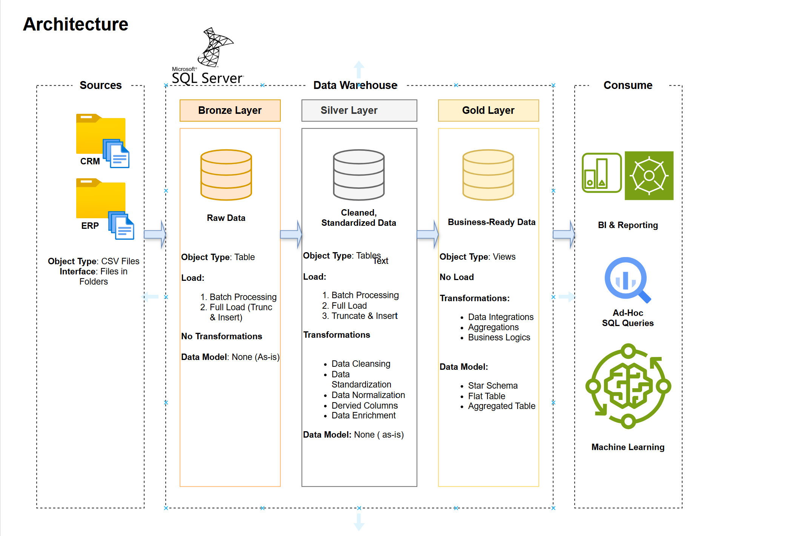

# SQL Server Data Warehouse — Medallion Architecture


---

## Overview

An end-to-end data warehouse built on **SQL Server** using **Medallion Architecture** (Bronze → Silver → Gold), integrating data from CRM and ERP source systems into a business-ready **Star Schema** for analytical reporting.

This project demonstrates production data engineering practices: layered data ingestion, T-SQL ETL pipelines, data quality validation, dimensional modelling, and a Power BI reporting layer — all applied to a realistic sales analytics use case.

> **Part of a broader Data Engineering portfolio** also including an Azure Databricks Medallion Pipeline (PySpark + Delta Lake) and an Azure Driver Behaviour Analytics Pipeline (ADF + Databricks + Power BI).

---

## Business Problem

Raw sales data from CRM and ERP systems is siloed, unstructured, and not queryable for business intelligence. This warehouse consolidates and transforms that data to answer:

- Which products and stores drive the most revenue?
- How do sales trend month-over-month and year-over-year?
- Who are the top customers by lifetime value?
- Where are the gaps in product and store performance?

---

## Architecture



The project follows **Medallion Architecture** entirely within SQL Server — demonstrating that this pattern is a data design principle, not just a Databricks/cloud concept.

| Layer | Object Type | Load Strategy | Purpose |
|---|---|---|---|
| **Bronze** | Tables | Full load (Truncate & Insert) | Raw data as-is from source CSVs |
| **Silver** | Tables | Full load (Truncate & Insert) | Cleansed, standardised, normalised |
| **Gold** | Views | No load (dynamic views on Silver) | Business-ready Star Schema for BI |

---

## Data Model — Star Schema

The Gold layer exposes a Star Schema optimised for analytical queries:

```
                    ┌─────────────┐
                    │  dim_date   │
                    └──────┬──────┘
                           │
┌──────────────┐    ┌──────┴──────┐    ┌──────────────┐
│ dim_customer ├────┤  fact_sales ├────┤  dim_product │
└──────────────┘    └──────┬──────┘    └──────────────┘
                           │
                    ┌──────┴──────┐
                    │  dim_store  │
                    └─────────────┘
```

**Fact table:** `fact_sales` — date_id, customer_id, product_id, store_id, quantity, sales_amount

**Dimension tables:** `dim_customer`, `dim_product`, `dim_store`, `dim_date`

---

## Data Sources

| Source | Format | Description |
|---|---|---|
| CRM system | CSV files | Customer profiles, contact info, segments |
| ERP system | CSV files | Products, stores, transactions, inventory |

Combined dataset: ~60,000 sales transactions across multiple customers, products, and store locations.

---

## ETL Pipeline

```
CSV Files (CRM + ERP)
       │
       ▼
  [Bronze Layer]
  Raw ingestion — no transformation
  Stored in: bronze schema
       │
       ▼
  [Silver Layer]
  - Data cleansing (nulls, duplicates)
  - Standardisation (date formats, codes)
  - Normalisation (consistent keys)
  - Derived columns (age, tenure, flags)
  - Data enrichment (lookups, joins)
  Stored in: silver schema
       │
       ▼
  [Gold Layer]
  - Star schema views
  - Business aggregations
  - KPI calculations
  Exposed as: Views in gold schema
       │
       ▼
  Power BI Dashboard
```

---

## Analytics & Reporting

The Gold layer supports the following analytical queries:

| Analysis | Description |
|---|---|
| Total revenue | Aggregate sales_amount across all transactions |
| Monthly sales trend | Revenue grouped by year and month |
| Sales by product | Top/bottom performing products by revenue |
| Sales by store | Store-level performance comparison |
| Top customers | Customers ranked by lifetime revenue |
| YoY growth | Year-over-year revenue change percentage |

All analytics are visualised in the **Power BI dashboard** (see `/docs` folder for screenshots).

---

## Project Structure

```
sql-data-warehouse-project/
│
├── datasets/               # Source CSV files (CRM and ERP raw data)
│
├── docs/                   # Architecture diagrams and documentation
│   ├── Architecture.png    # Medallion architecture diagram
│   ├── data_models.drawio  # Star schema data model (Draw.io)
│   ├── data_flow.drawio    # ETL flow diagram
│   └── data_catalog.md     # Field definitions and metadata
│
├── scripts/                # All T-SQL scripts
│   ├── bronze/             # Raw data ingestion scripts
│   ├── silver/             # Cleansing and transformation scripts
│   └── gold/               # Star schema view definitions
│
├── tests/                  # Data quality validation scripts
│   └── quality_checks.sql  # Row count, null checks, referential integrity
│
├── README.md
└── LICENSE
```

---

## How to Run

### Prerequisites
- SQL Server 2019+ (or SQL Server Express — free)
- SQL Server Management Studio (SSMS)
- Power BI Desktop (for dashboard)

### Setup Steps

**1. Clone the repository**
```bash
git clone https://github.com/saikrishna4512/sql-data-warehouse-project.git
cd sql-data-warehouse-project
```

**2. Initialise the database**
```sql
-- Run in SSMS
-- Creates DataWarehouse database with bronze, silver, gold schemas
scripts/init_database.sql
```

**3. Load Bronze layer**
```sql
-- Ingests raw CSV files into bronze schema tables
-- Update file paths to match your local datasets/ folder location
scripts/bronze/load_bronze.sql
```

**4. Load Silver layer**
```sql
-- Cleanses and transforms bronze data into silver schema
scripts/silver/load_silver.sql
```

**5. Create Gold layer views**
```sql
-- Creates Star Schema views in gold schema
scripts/gold/load_gold.sql
```

**6. Run data quality tests**
```sql
-- Validates row counts, nulls, and referential integrity
tests/quality_checks.sql
```

**7. Connect Power BI**
- Open Power BI Desktop
- Connect to SQL Server → select `DataWarehouse` database
- Load gold schema views
- Dashboard template in `docs/` folder

---

## Key Concepts Demonstrated

| Concept | Implementation |
|---|---|
| Medallion Architecture | Bronze / Silver / Gold layers in SQL Server |
| Star Schema | Fact + 4 dimension tables in Gold layer |
| ETL Pipeline | T-SQL stored procedures across all 3 layers |
| Data Cleansing | Null handling, deduplication, standardisation in Silver |
| Derived Columns | Computed fields added in Silver transformation |
| Data Quality Testing | Row count, null, and FK validation scripts |
| Analytical Queries | Revenue, trends, segmentation in Gold layer |
| BI Reporting | Power BI connected to Gold views |

---

## Tech Stack

| Tool | Purpose |
|---|---|
| SQL Server 2019 | Database engine and data warehouse host |
| T-SQL | ETL scripts, transformations, stored procedures |
| SSMS | Database management and script execution |
| Power BI Desktop | Dashboard and analytical reporting |
| Draw.io | Architecture and data model diagrams |
| Git / GitHub | Version control |

---

## Future Enhancements

- [ ] Slowly Changing Dimensions (SCD Type 2) for customer and product history
- [ ] Incremental load strategy to replace full truncate-and-insert
- [ ] Index optimisation on fact table for large-scale query performance
- [ ] Migration to **Azure Synapse Analytics** for cloud-scale warehousing
- [ ] Orchestration with **Azure Data Factory** for scheduled pipeline runs

---

## Related Portfolio Projects

| Project | Stack | Link |
|---|---|---|
| Databricks Medallion Pipeline | PySpark · Delta Lake · Azure · DP-750 | *(link)* |
| Vehicle Tracking + Driver Behaviour Analytics | ADF · Databricks · Azure · Power BI | *(link)* |

---

## Author

**Sai Krishna Reddy Kaithi**
Vancouver, Canada

Data Engineer · Azure Databricks (DP-750) · SQL Server · PySpark · Power BI

[](https://linkedin.com/in/sai-krishna-reddy-kaithi-14008b27a)
[](https://github.com/saikrishna4512)

---

*This project is licensed under the MIT License.*
